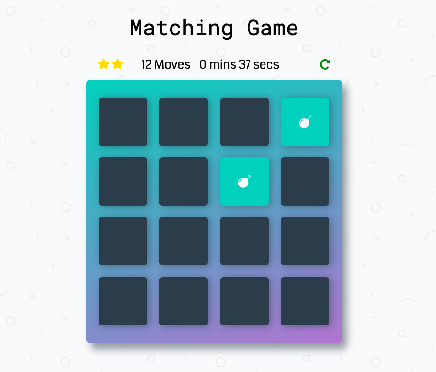

## Memory Game decription
This is memory game allows user to pick cards, once all 16 cards are matched, game is over!

## Challenge of game
Try to match all cards with less moves.

## Instructions for game
* Click on a first card, then on second card.
* In case those cards not same (game will close them up), continue play.
* Once cards are matched, cards will change color to green, and stay opened.
* Once all 16 cards are matched, pop up modal will appear saying how many moves and time was consumed by user.

